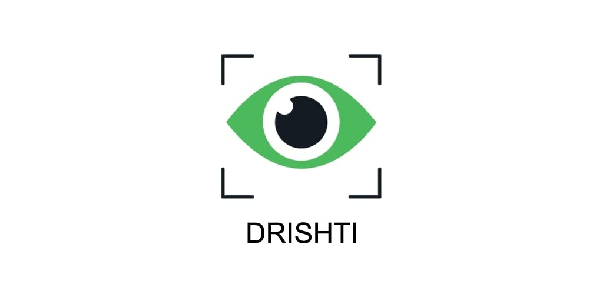
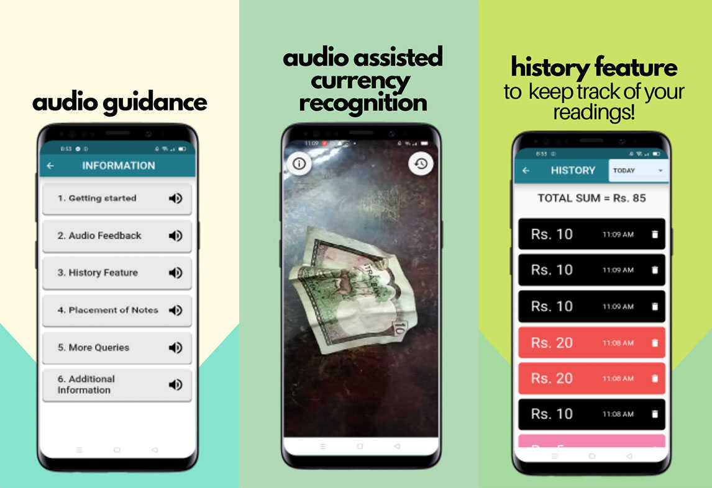

Drishti *(Nepali: दृष्टि | English: Vision)* is an open-source cross-platform mobile application project at Incubate Nepal that incorporates Machine Learning and Artificial Intelligence to help visually impaired people recognize different currency bills and perform daily cash transactions more effectively.

We plan to expand Drishti to other applications like Short Text and Document Reading in the future.

---

## Table of Contents

- [Table of Contents](#table-of-contents)
- [General Information](#general-information)
- [Project Deliverables](#project-deliverables)
- [Installation](#installation)
- [App Demo](#app-demo)
- [Screenshots](#screenshots)
- [Technologies](#technologies)
- [Techstack](#techstack)
- [Features](#features)
- [Status](#status)
- [Inspiration](#inspiration)
- [Contributing](#contributing)
- [Contact Us](#contact-us)
- [License](#license)

---

## General Information

The mobile application is used by the visually impaired community to recognize different currency bills and perform their daily cash transactions more easily. This user-friendly app uses the phone camera, accessibility features, and gestures to provide the desired results.

---

## Project Deliverables

* Mobile Application
* Computer Vision Model
* Website

---

## Installation

The app is now available on Google Play Store as [**Drishti Nepal**](https://play.google.com/store/apps/details?id=com.drishtinepal).

---

## App Demo

https://user-images.githubusercontent.com/18349557/118524088-81a75200-b75d-11eb-8f5f-f6a015ae0529.mp4

---

## Screenshots

---

## Technologies

* Flutter
* Python
* Tensorflow

---

## Techstack

* Frontend: **Flutter**
* Data science: 
    - Experimentation: **PyTorch**
    - Training: **Tensorflow**
    - Deployment: **Tflite (Tensorflow Lite)**
* Website: **HTML**, **CSS**, **JavaScript**

---

## Features

List of implemented features:
* Audio feedback in Native Language (Nepali)
* Ad-free
* Available to use Offline
* History Feature
    * Keep Track of Scanned Notes
    * Sum up the transactions
    * Classify the Scanned Notes ("Today", "This Week", "This Month")

TODOs for future development:
* Add haptic feedback for Cash Recognition
* Implement Short Text and Document Reading (Nepali)

---

## Status

- [X] Cash Recognition Feature
- [ ] Short Text and Document Reading

---

## Inspiration

Drishti app is particularly developed for the blind and low vision community of Nepal. To understand the need of our end users, the team studied and empathized with the blind and low-vision individuals from [Blind Youth Association Nepal](https://www.byanepal.org/) rather than digging into the financial problems faced by them.

After interviewing more than 50 visually impaired individuals, we found that they are already using some cash recognizing apps but are not satisfied with them. Some interviewees also shed light on their daily difficulties while traveling. They have suggested to include some additional features of location tracking and user friendly GPS in our future iterations. Our basic goal is to make a robust application which could benefit them.

| As a/an           | I want to                                                       | So that I can                                                 | Status of progress |
| ----------------- | --------------------------------------------------------------- | ------------------------------------------------------------- | ------------------ |
| User              | Scan the currency  notes at a bank                              | Confirm the total sum of money I received                     | Done               |
| User              | Identify the bills in the dark using my flashlight              | Transact money during the evening too                         | Done               |
| Developer         | Get the feedback from the users                                 | Make necessary upgrades in the application                    | Done               |
| Product Owner     | Know the progress made in the application during each iteration | Prioritize the future goals for the project                   | Done               |
| User              | Recognize the bills without having to ask others                | Be independent in  my financial affairs                       | Done               |
| User              | Have a simple UI in my application                              | Easily navigate into the app                                  | Done               |
| User              | Have the buttons labeled in the app                             | Properly recognize the buttons using my phone’s screen reader | Done               |
| Software engineer | Easily get the source code of the app                           | Modify the app and improve its accuracy                       | Done               |
| User              | See the history of my scanned notes in a day                    | I can keep a record of my expenditure list conveniently       | Done               |

---

## Contributing

There are many ways in which you can participate in the project, for example:

* [Submit bugs and feature requests](https://github.com/DrishtiNP/Drishti/issues), and help us verify as they are checked in
* Review [source code changes](https://github.com/DrishtiNP/Drishti/pulls)

If you are interested in fixing issues and contributing directly to the code base, you can submit us a pull request directly at [Drishti Pull Requests](https://github.com/DrishtiNP/Drishti/pulls).

---

## Contact Us
- Email: **projectdrishti2021@gmail.com**
- [Facebook](https://www.facebook.com/Drishtinepal2021/)
- [Instagram](https://www.instagram.com/drishti.nepal/)

---

## License

Drishti is MIT licensed, as found in the [LICENSE](LICENSE) file.

